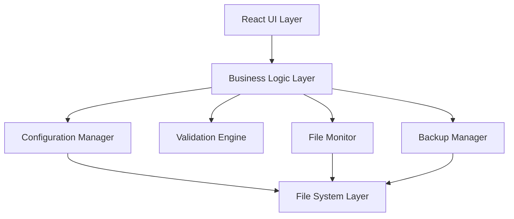

# Design Document

## Overview

The MCP Configuration Manager (MCM) is an Electron-based desktop application that provides a unified interface for managing Model Context Protocol server configurations across multiple AI client applications. The application follows a modular architecture with clear separation between the UI layer, business logic, and file system operations.

## Architecture

### High-Level Architecture



### Technology Stack

- **Frontend**: React 18 with TypeScript
- **Desktop Framework**: Electron 28+
- **State Management**: Zustand for lightweight state management
- **UI Components**: Ant Design for consistent macOS-native feel
- **Code Editor**: Monaco Editor for JSON editing with syntax highlighting
- **File Operations**: Node.js fs-extra for robust file system operations
- **Configuration Parsing**: JSON5 for flexible JSON parsing with comments
- **File Watching**: chokidar for cross-platform file system monitoring
- **Testing**: Jest + React Testing Library + Electron testing utilities

## Components and Interfaces

### Core Components

#### 1. Configuration Manager (`ConfigurationManager`)
```typescript
interface ConfigurationManager {
  discoverClients(): Promise<MCPClient[]>
  loadConfiguration(client: MCPClient, scope: ConfigScope): Promise<Configuration>
  saveConfiguration(client: MCPClient, config: Configuration, scope: ConfigScope): Promise<void>
  validateConfiguration(config: Configuration): ValidationResult
  testServerConnection(server: MCPServer): Promise<TestResult>
}
```

#### 2. Scope Manager (`ScopeManager`)
```typescript
interface ScopeManager {
  resolveConfiguration(client: MCPClient): Promise<ResolvedConfiguration>
  getConfigurationPaths(client: MCPClient): ConfigurationPaths
  detectScopeConflicts(server: MCPServer): ScopeConflict[]
  migrateServerScope(server: MCPServer, fromScope: ConfigScope, toScope: ConfigScope): Promise<void>
}
```

#### 3. File Monitor (`FileMonitor`)
```typescript
interface FileMonitor {
  watchConfigurationFiles(paths: string[]): void
  onConfigurationChanged(callback: (path: string, change: FileChange) => void): void
  detectExternalChanges(): Promise<ExternalChange[]>
  resolveConflicts(conflicts: FileConflict[]): Promise<void>
}
```

#### 4. Backup Manager (`BackupManager`)
```typescript
interface BackupManager {
  createBackup(filePath: string): Promise<string>
  listBackups(filePath: string): Promise<Backup[]>
  restoreBackup(backupPath: string, targetPath: string): Promise<void>
  cleanupOldBackups(maxAge: number, maxCount: number): Promise<void>
}
```

### UI Components

#### 1. Main Application Layout
- **ClientListPanel**: Tree view of detected MCP clients with status indicators
- **ConfigurationEditor**: Tabbed interface with form and JSON editor modes
- **ServerManagementPanel**: Server list with CRUD operations
- **StatusBar**: Real-time status and scope indicators

#### 2. Specialized Dialogs
- **ServerConfigurationDialog**: Form-based server configuration
- **ScopeConflictResolver**: Visual conflict resolution interface
- **BackupRestoreDialog**: Backup management interface
- **SettingsDialog**: Application preferences

## Data Models

### Core Data Types

```typescript
// MCP Client representation
interface MCPClient {
  id: string
  name: string
  type: ClientType
  version?: string
  configPaths: ConfigurationPaths
  status: ClientStatus
  isActive: boolean
}

// Configuration scope hierarchy
enum ConfigScope {
  GLOBAL = 'global',
  USER = 'user', 
  LOCAL = 'local',
  PROJECT = 'project'
}

// MCP Server configuration
interface MCPServer {
  name: string
  command: string
  args: string[]
  env: Record<string, string>
  cwd?: string
  scope: ConfigScope
  enabled: boolean
}

// Complete configuration for a client
interface Configuration {
  mcpServers: Record<string, MCPServer>
  metadata: {
    lastModified: Date
    version: string
    scope: ConfigScope
  }
}

// Resolved configuration after scope merging
interface ResolvedConfiguration {
  servers: Record<string, MCPServer>
  conflicts: ScopeConflict[]
  sources: Record<string, ConfigScope>
}

// Scope conflict detection
interface ScopeConflict {
  serverName: string
  scopes: Array<{
    scope: ConfigScope
    config: MCPServer
    priority: number
  }>
  activeConfig: MCPServer
}
```

### Client-Specific Configurations

```typescript
// Client type definitions
enum ClientType {
  CLAUDE_DESKTOP = 'claude-desktop',
  CLAUDE_CODE = 'claude-code', 
  CODEX = 'codex',
  VS_CODE = 'vscode',
  GEMINI_DESKTOP = 'gemini-desktop',
  GEMINI_CLI = 'gemini-cli'
}

// Client-specific configuration paths
interface ConfigurationPaths {
  primary: string
  alternatives: string[]
  scopePaths: Record<ConfigScope, string>
}

// Client detection and validation
interface ClientDetector {
  detect(): Promise<MCPClient[]>
  validateClient(client: MCPClient): Promise<boolean>
  getClientVersion(client: MCPClient): Promise<string>
}
```

## Error Handling

### Error Categories

1. **File System Errors**
   - Permission denied
   - File not found
   - Disk space issues
   - Concurrent access conflicts

2. **Configuration Errors**
   - Invalid JSON syntax
   - Missing required fields
   - Invalid server commands
   - Scope conflicts

3. **Network/Connection Errors**
   - Server connection failures
   - Timeout errors
   - Authentication failures

### Error Handling Strategy

```typescript
// Centralized error handling
interface ErrorHandler {
  handleFileSystemError(error: FileSystemError): ErrorResponse
  handleConfigurationError(error: ConfigurationError): ErrorResponse
  handleNetworkError(error: NetworkError): ErrorResponse
  showUserFriendlyError(error: ApplicationError): void
}

// Error recovery mechanisms
interface ErrorRecovery {
  attemptAutoRecovery(error: ApplicationError): Promise<boolean>
  suggestManualFix(error: ApplicationError): FixSuggestion[]
  createErrorReport(error: ApplicationError): ErrorReport
}
```

## Testing Strategy

### Unit Testing
- **Configuration Manager**: Test all CRUD operations and validation logic
- **Scope Manager**: Test scope resolution and conflict detection
- **File Monitor**: Test file watching and change detection
- **Backup Manager**: Test backup creation and restoration

### Integration Testing
- **End-to-End Workflows**: Test complete user workflows from UI to file system
- **Client Integration**: Test with actual MCP client configurations
- **Cross-Platform**: Test file operations across different macOS versions

### UI Testing
- **Component Testing**: Test individual React components
- **User Interaction**: Test form validation and user feedback
- **Accessibility**: Test keyboard navigation and screen reader compatibility

### Test Data Management
```typescript
// Test fixtures for different client configurations
interface TestFixtures {
  claudeDesktopConfig: Configuration
  claudeCodeConfig: Configuration
  codexConfig: Configuration
  conflictScenarios: ScopeConflict[]
  invalidConfigurations: InvalidConfig[]
}
```

## Performance Considerations

### File System Operations
- **Lazy Loading**: Load configurations only when needed
- **Caching**: Cache parsed configurations with invalidation
- **Batch Operations**: Group multiple file operations together
- **Debounced Saves**: Prevent excessive file writes during rapid changes

### Memory Management
- **Configuration Cleanup**: Dispose of unused configuration objects
- **File Watcher Cleanup**: Properly dispose of file system watchers
- **React Optimization**: Use React.memo and useMemo for expensive operations

### Startup Performance
- **Progressive Loading**: Load UI first, then discover clients asynchronously
- **Background Discovery**: Perform client detection in background threads
- **Cached Discovery**: Cache client detection results with TTL

## Security Considerations

### File System Security
- **Path Validation**: Validate all file paths to prevent directory traversal
- **Permission Checks**: Verify read/write permissions before operations
- **Sandboxing**: Use Electron's sandbox mode where possible

### Configuration Security
- **Environment Variable Handling**: Secure storage and display of sensitive env vars
- **Command Validation**: Validate executable paths and arguments
- **Backup Encryption**: Consider encrypting sensitive backup data

### Process Security
- **Server Testing**: Isolate server connection tests in separate processes
- **Command Execution**: Sanitize and validate all executed commands
- **Network Isolation**: Limit network access for security testing

## Platform-Specific Implementation

### macOS Integration
- **Native UI Elements**: Use macOS-native styling and behaviors
- **File System Events**: Leverage FSEvents for efficient file monitoring
- **Application Bundle**: Proper app bundle structure and code signing
- **Keychain Integration**: Store sensitive data in macOS Keychain if needed

### File Path Handling
```typescript
// macOS-specific path resolution
interface MacOSPathResolver {
  resolveApplicationSupport(appName: string): string
  resolveUserConfig(appName: string): string
  resolveHomeDirectory(): string
  expandTildeInPath(path: string): string
}
```

## Deployment and Distribution

### Build Process
- **Electron Builder**: Configure for macOS app bundle creation
- **Code Signing**: Apple Developer certificate for distribution
- **Notarization**: Apple notarization for Gatekeeper compatibility
- **Auto-Updates**: Implement secure auto-update mechanism

### Installation
- **DMG Creation**: Create user-friendly disk image installer
- **First-Run Setup**: Guide users through initial configuration
- **Migration**: Import existing configurations from manual setups

This design provides a solid foundation for implementing all the requirements while maintaining good separation of concerns, testability, and platform-specific optimizations for macOS.