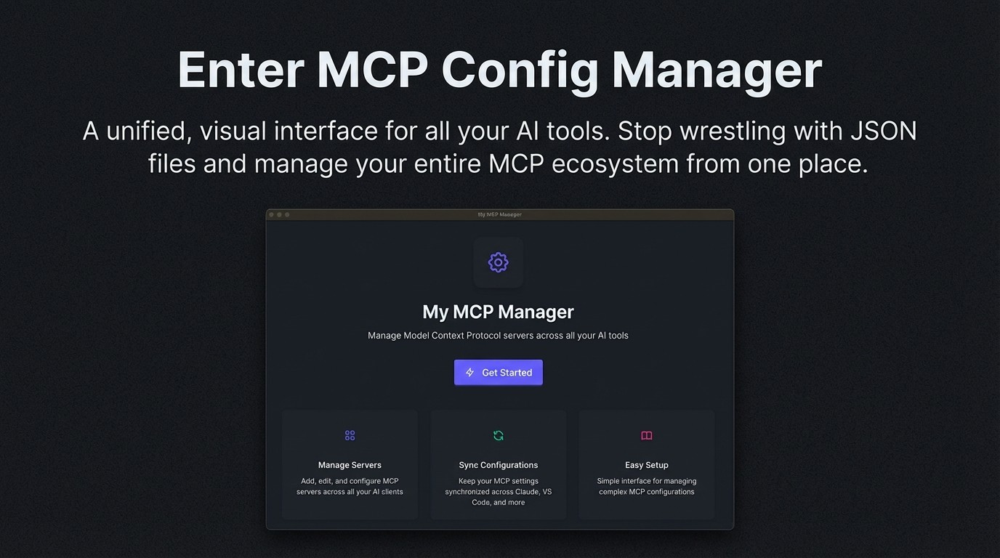
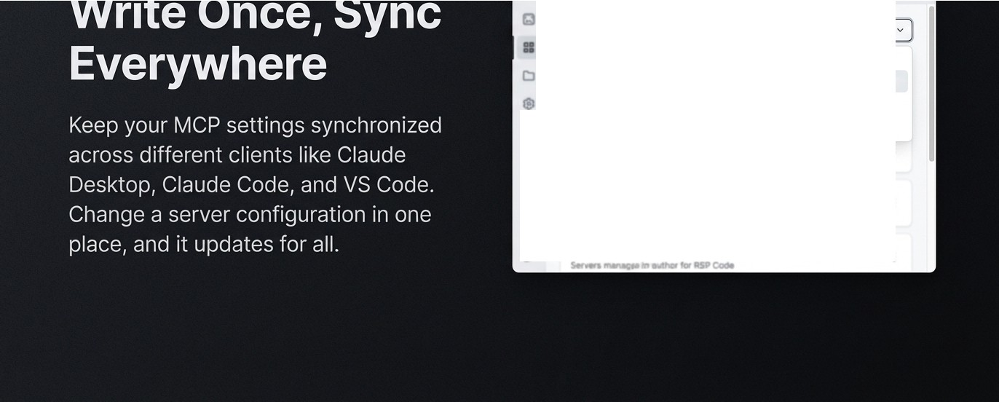
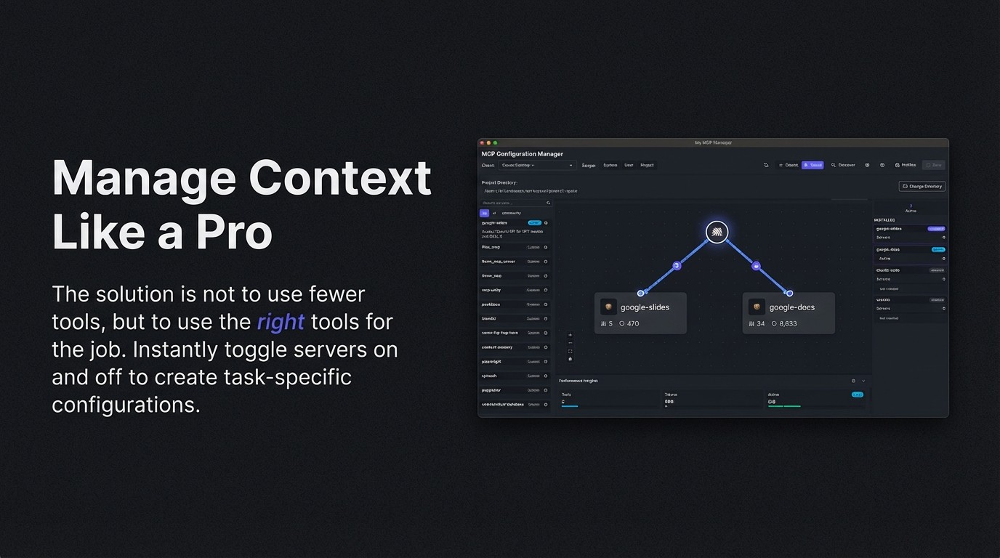

# Slide 1
## Images
- 
## Content

---

# Slide 2
## Images
- 
## Content

---

# Slide 3
## Images
- 
## Content

---

# Slide 4
## Images
- 
## Content

---

# Slide 5
## Images
- 
## Content

---

# Slide 6
## Images
- 
## Content

---

# Slide 7
## Images
- 
## Content

---

# Slide 8
## Images
- 
- 
- 
## Content
- Write Once, Sync Everywhere
- Keep your MCP settings synchronized across different clients like Claude Desktop, Claude Code, and VS Code.
- Change a server configuration in one place, and it updates for all.

---

# Slide 9
## Images
- 
## Content

---

# Slide 10
## Images
- 
## Content

---

# Slide 11
## Images
- 
## Content

---

# Slide 12
## Images
- 
- 
- 
- 
- 
## Content

---

# Slide 13
## Content

---

# Slide 14
## Images
- 
## Content

---

# Slide 15
## Content

---

# Slide 16
## Images
- 
## Content

---

# Slide 17
## Images
- 
## Content

---

# Slide 18
## Images
- 
## Content

---

# Slide 19
## Images
- 
## Content

---

# Slide 20
## Images
- 
## Content

---

# Slide 21
## Images
- 
## Content

---
