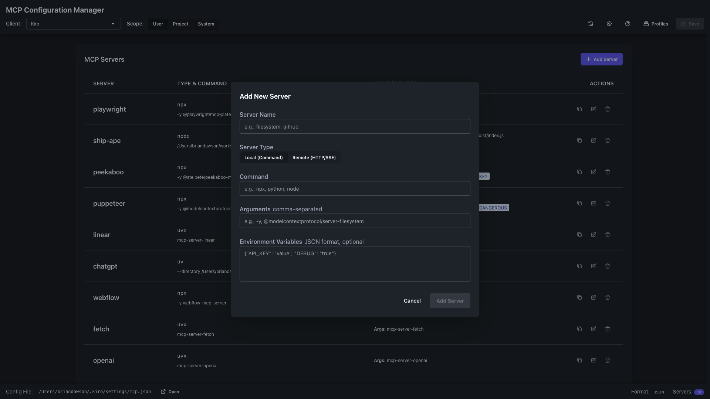

# MCP Configuration Manager - Features Overview

A visual guide to all the features of MCP Configuration Manager.

## 🎯 Core Features

### Unified Interface for All AI Clients

Manage MCP servers across multiple AI applications from one place:

**Supported Clients:**
- ✅ Claude Desktop
- ✅ Claude Code
- ✅ Kiro *(New)*
- ✅ Windsurf *(New)*
- ✅ Cursor
- ✅ VS Code
- ✅ Codex
- ✅ Gemini Desktop
- ✅ Gemini CLI
- ✅ Custom clients (configurable)

---

## 🚀 Getting Started

### Welcome Screen
Clean, modern interface to get you started quickly:

### One-Click Setup
Simple Get Started button to begin:

---

## 📊 Server Management

### Comprehensive Server List

View all your MCP servers at a glance with detailed information:

**Features:**
- Server name and type
- Command and arguments
- Environment variables
- Quick action buttons
- Server count badge

### Detailed Server Information

Each server shows complete configuration details:

---

## ➕ Adding & Configuring Servers

### Intuitive Add Server Modal

Simple form-based interface for adding new servers:

### Complete Configuration Example

Full server configuration with all fields filled:

### Environment Variables

JSON-based environment variable configuration with syntax highlighting:

**Features:**
- JSON format for complex configurations
- Syntax validation
- Auto-formatting
- Copy/paste support

---

## 🔄 Configuration Scopes

### Multi-Level Configuration Management

Switch between different configuration scopes easily:

### User Scope (Default)
Personal configurations for your user account

### Project Scope
Project-specific configurations that override user settings:

### System Scope
Global configurations for all users on the system:

---

## 🎨 User Interface Elements

### Navigation Toolbar

Clean, organized top navigation with all essential controls:

**Components:**
- Client selector dropdown
- Scope selection buttons
- Settings access
- Profile management
- Save button

### Status Bar

Real-time information about current configuration:

**Shows:**
- Active configuration file path
- Save status
- Server count
- Current scope

### Client Selection

Quick client switching with dropdown menu:

---

## 🎨 Visual Workspace *(New Feature)*

### Interactive Canvas Interface

Transform your MCP configuration management with our new visual workspace:

**Key Features:**
- **Drag-and-drop server management** - Simply drag servers from the library
- **Visual connection mapping** - See server-to-client relationships
- **Real-time status monitoring** - Animated cables show data flow
- **Intuitive organization** - Arrange servers visually

### Components:
- **Server Library** (Left) - Categorized list of available servers
- **Interactive Canvas** (Center) - Visual network of your configuration
- **Client Dock** (Bottom) - Quick switching between AI clients
- **Insights Panel** (Right) - Real-time metrics and analytics

---

## 🔍 Server Discovery *(New Feature)*

### MCP Server Marketplace

Browse, discover, and install MCP servers from multiple sources:

**Discovery Sources:**
- **MCP Registry** - Official catalog with 100+ verified servers
- **GitHub Search** - Find community-created servers
- **NPM Packages** - Published MCP server packages

**Features:**
- **Smart search and filtering** by category and status
- **One-click installation** with automatic configuration
- **Server details** with documentation and reviews
- **Update notifications** for installed servers

---

## 🔧 Advanced Features

### Visual Workspace Integration

Full visual management of MCP servers with React Flow:
- Node-based interface for intuitive configuration
- Real-time connection status with animated cables
- Drag-and-drop server organization
- Performance metrics visualization

### Discovery & Installation

Marketplace-like experience for finding new servers:
- Browse 100+ community servers
- Filter by category (AI, Development, Data, etc.)
- One-click installation and configuration
- Automatic dependency management

### Kiro & Windsurf Integration

Full support for newest AI clients:

### Enhanced Bulk Operations
- Visual multi-select in workspace
- Drag multiple servers at once
- Bulk configuration updates
- Mass enable/disable with visual feedback

### Advanced Configuration Validation
- Visual indicators for configuration issues
- Real-time path and command validation
- Environment variable verification with suggestions
- Connection health monitoring

### Intelligent Auto-Detection
- Automatically finds all installed AI clients
- Discovers MCP servers from npm and GitHub
- Updates configuration paths dynamically
- Monitors for new client installations

---

## 💡 Key Benefits

### 🚫 No More JSON Editing
- Visual form-based editing
- Syntax validation
- Auto-formatting
- Error prevention

### 🔄 Cross-Client Sync
- Copy servers between clients
- Import/export configurations
- Profile sharing
- Backup and restore

### 🛡️ Safe Configuration
- Validation before saving
- Backup on changes
- Undo/redo support
- Non-destructive editing

### ⚡ Productivity Features
- Keyboard shortcuts
- Quick actions
- Search and filter
- Bulk operations

---

## 📱 Responsive Design

### Full Screen View
Optimized for desktop use at 1920x1080:

### Adaptive Layout
- Responsive to window size
- Collapsible panels
- Mobile-friendly controls
- Touch-optimized buttons

---

## 🎯 Use Cases

### Development Teams
- Share MCP configurations via profiles
- Project-specific server settings
- Consistent team environments
- Version control friendly

### Individual Developers
- Quick server setup
- Easy environment management
- Multiple client support
- Portable configurations

### System Administrators
- Deploy system-wide configurations
- Manage multiple user setups
- Centralized control
- Bulk provisioning

---

## 🔒 Security Features

- **No credentials in code**: Environment variables for secrets
- **Scope isolation**: Project configs don't affect other projects
- **Validation**: Prevents malformed configurations
- **Safe defaults**: Secure configuration templates

---

## 📈 Recently Added

### Version 0.1.4 Features
- ✅ **Visual Workspace** - Interactive canvas for server management
- ✅ **Server Discovery** - Marketplace for finding MCP servers
- ✅ **Kiro & Windsurf Support** - Integration with newest AI clients
- ✅ **Enhanced Drag-and-Drop** - Visual server configuration
- ✅ **Real-time Metrics** - Token usage and performance tracking
- ✅ **Server Library** - Categorized server browser
- ✅ **Connection Visualization** - Animated connection cables
- ✅ **One-click Installation** - Simplified server setup

## 🚀 Coming Soon

### Q1 2025 Roadmap
- **Cloud Sync** - Backup and sync configurations across devices
- **Team Collaboration** - Share configurations with your team
- **Advanced Analytics** - Detailed usage statistics and insights
- **Custom Server Builder** - Create your own MCP servers visually
- **AI-Powered Suggestions** - Smart server recommendations
- **Performance Profiling** - Identify and optimize bottlenecks
- **Enterprise Management** - Organization-wide configuration control
- **Plugin System** - Extend functionality with custom plugins

---

## 🆘 Getting Help

- **User Guide**: [Complete documentation](USER_GUIDE.md)
- **Quick Start**: [5-minute setup](QUICK_START.md)
- **GitHub**: [Report issues](https://github.com/thechrisgreen/mcp-config-manager/issues)
- **Discord**: Community support

---

*MCP Configuration Manager - Making MCP server management simple, visual, and powerful.*