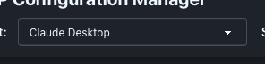
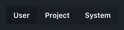

# MCP Configuration Manager - Quick Start Guide

Get up and running with MCP Configuration Manager in 5 minutes!

## 1. Installation (30 seconds)

### macOS
```bash
# Download and install
curl -L https://github.com/thechrisgreen/mcp-config-manager/releases/latest/download/MCP-Configuration-Manager.dmg -o mcm.dmg
open mcm.dmg
# Drag to Applications folder
```

### First Launch on macOS
Right-click the app and select "Open" to bypass Gatekeeper on first launch.

## 2. Launch & Setup (1 minute)

1. **Open the app** from your Applications folder
2. **Click "Get Started"** on the welcome screen


3. **Select your AI client** from the dropdown



## 3. Add Your First MCP Server (2 minutes)

### Quick Example: GitHub MCP Server

1. **Click "Add Server"** button
2. Fill in:
   - **Name**: `GitHub MCP Server`
   - **Command**: `npx`
   - **Arguments**: `@modelcontextprotocol/server-github`
   - **Environment Variables**:
```json
{
  "GITHUB_TOKEN": "your-github-token-here"
}
```


3. **Click "Add Server"** to save
4. **Click "Save"** in the main window to apply changes

## 4. Verify Installation (30 seconds)

1. Restart your AI client (Claude Desktop, Kiro, etc.)
2. Your MCP server should now be available!

## Common MCP Servers - Copy & Paste Ready

### Filesystem Access
```json
{
  "name": "Filesystem",
  "command": "npx",
  "args": ["@modelcontextprotocol/server-filesystem", "/Users/yourusername/Documents"],
  "env": {}
}
```

### Postgres Database
```json
{
  "name": "Postgres",
  "command": "npx",
  "args": ["@modelcontextprotocol/server-postgres", "postgresql://localhost/mydb"],
  "env": {}
}
```

### Puppeteer Web Automation
```json
{
  "name": "Puppeteer",
  "command": "npx",
  "args": ["@modelcontextprotocol/server-puppeteer"],
  "env": {
    "PUPPETEER_LAUNCH_OPTIONS": "{\"headless\": false}"
  }
}
```

### Memory/Knowledge Graph
```json
{
  "name": "Memory",
  "command": "npx",
  "args": ["@modelcontextprotocol/server-memory"],
  "env": {}
}
```

## Scope Selection - Where Are Configs Saved?



- **User** (default): Personal configs in home directory
- **Project**: Project-specific configs (select a directory first)
- **System**: Global configs for all users (requires admin)

## Need Help?

- **Full User Guide**: [Complete documentation](USER_GUIDE.md)
- **Troubleshooting**: [Common issues](USER_GUIDE.md#troubleshooting)
- **Report Issues**: [GitHub Issues](https://github.com/thechrisgreen/mcp-config-manager/issues)

## Keyboard Shortcuts

| Action | Shortcut |
|--------|----------|
| Save | `Cmd/Ctrl + S` |
| Add Server | `Cmd/Ctrl + N` |
| Settings | `Cmd/Ctrl + ,` |
| Quit | `Cmd/Ctrl + Q` |

---

🎉 **That's it!** You're ready to manage your MCP servers with ease.