# MCP Configuration Manager - User Guide

> ⚠️ **Beta Version Notice**
>
> This application is in active development. Basic functionality has been confirmed and automatic backups are created for all configuration changes. However, further testing is still required. Please [report any bugs or issues](https://github.com/itsocialist/mcp-config-manager/issues) you encounter.

## Table of Contents
- [Introduction](#introduction)
- [Quick Start](#quick-start)
- [Installation](#installation)
- [Getting Started](#getting-started)
- [Main Interface](#main-interface)
- [Visual Workspace](#visual-workspace)
- [Server Discovery](#server-discovery)
- [Managing MCP Servers](#managing-mcp-servers)
- [Configuration Scopes](#configuration-scopes)
- [Settings](#settings)
- [Profiles](#profiles)
- [Troubleshooting](#troubleshooting)
- [Keyboard Shortcuts](#keyboard-shortcuts)

---

## Introduction

MCP Configuration Manager (MCM) is a unified desktop application for managing Model Context Protocol (MCP) server configurations across multiple AI client applications. It eliminates manual JSON editing and provides a centralized interface with form-based editing, validation, scope management, and cross-client synchronization.

### Supported AI Clients
- Claude Desktop
- Claude Code
- Kiro
- Windsurf
- Cursor
- VS Code
- Codex
- Gemini Desktop
- Gemini CLI

---

## Quick Start

### 1. Launch the Application

When you first launch MCP Configuration Manager, you'll see the welcome screen:

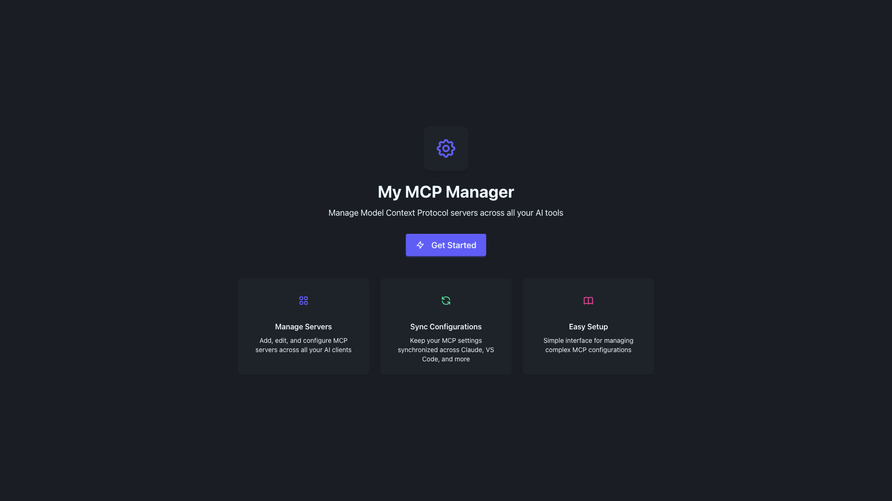

### 2. Click Get Started

Click the **Get Started** button to begin managing your MCP servers:


### 3. Select Your AI Client

The main interface will appear. Select your AI client from the dropdown menu to view and manage its MCP server configurations:


---

## Installation

### macOS
1. Download the latest `.dmg` file from the [releases page](https://github.com/thechrisgreen/mcp-config-manager/releases)
2. Open the downloaded file and drag the app to your Applications folder
3. On first launch, you may need to bypass Gatekeeper:
   - Right-click the app and select "Open"
   - Click "Open" in the security dialog


---

## Getting Started

### Understanding the Interface

The main interface consists of several key components:

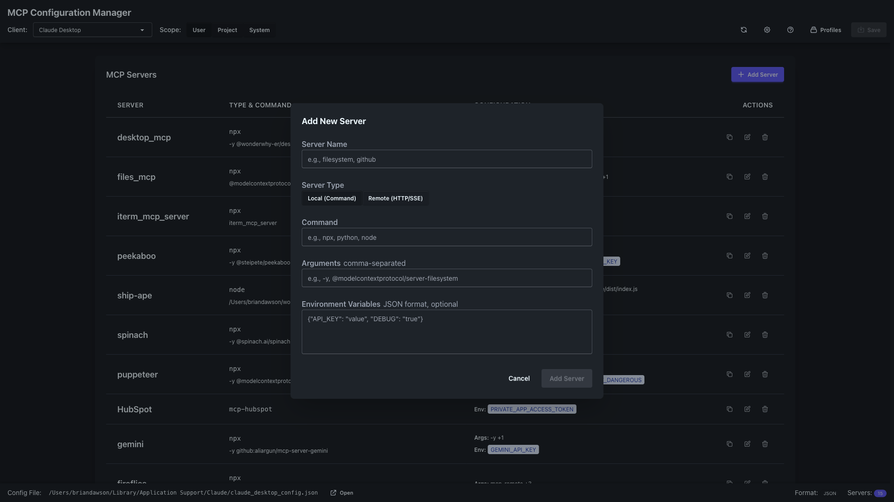

#### Top Navigation Bar

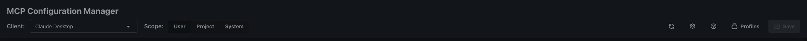

- **Client Selector**: Choose which AI client's configuration to manage
- **Scope Buttons**: Switch between User, Project, and System configurations
- **Action Buttons**: Settings, Profiles, and Save options

#### Client Dropdown

Select your AI client from the dropdown menu. The app automatically detects installed clients:


#### Scope Selection

Choose the configuration scope you want to work with:


- **User**: Personal configurations in your home directory
- **Project**: Project-specific configurations (requires a project directory)
- **System**: System-wide configurations (may require admin privileges)

---

## Visual Workspace

The Visual Workspace provides an intuitive, canvas-based interface for managing MCP server connections. This feature transforms the traditional list-based configuration into an interactive visual experience.

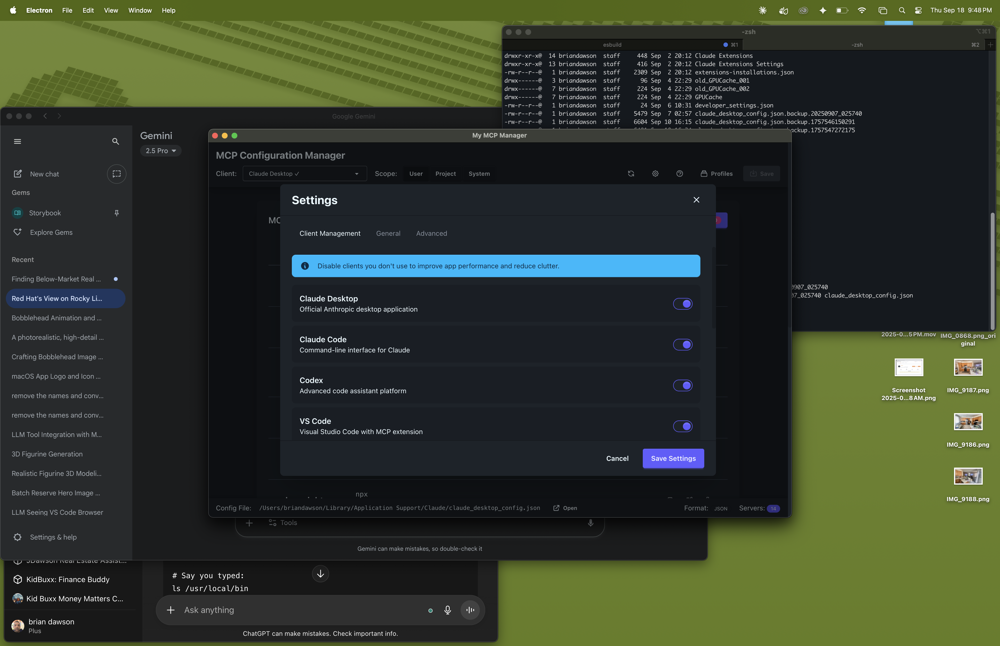

### Accessing Visual Workspace

Click the **Visual Workspace** tab in the main navigation to access the canvas interface.

### Key Components

#### 1. Server Library (Left Panel)

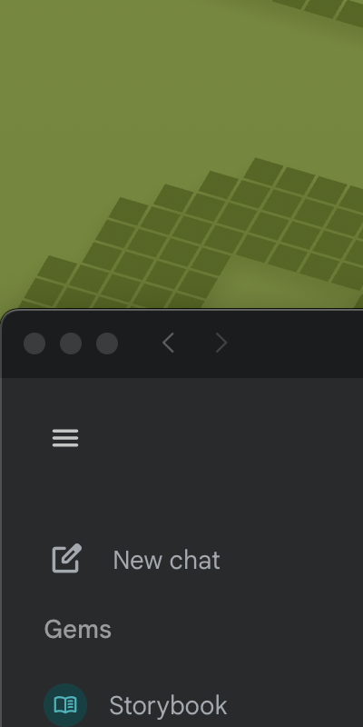

The Server Library contains all available MCP servers organized by category:
- **Development**: Code editing, Git, database tools
- **AI Tools**: LLMs, embeddings, vector databases
- **Productivity**: Task management, note-taking, automation
- **Data**: Analytics, processing, visualization
- **Communication**: Email, messaging, notifications
- **Utilities**: File management, system tools

**Using the Server Library:**
- Browse servers by expanding categories
- Drag servers from the library onto the canvas
- Search for specific servers using the search bar
- View server details by hovering over items

#### 2. Interactive Canvas (Center)

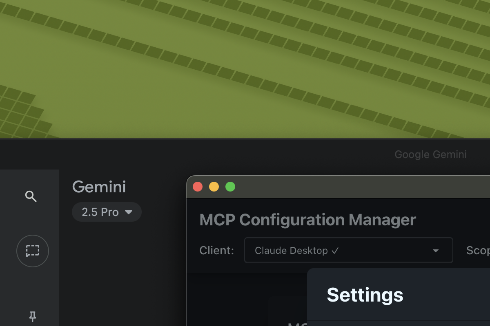

The main canvas area displays your MCP configuration as a visual network:
- **Server Nodes**: Represent individual MCP servers with icons and labels
- **Client Node**: Shows the active AI client (Claude, VS Code, etc.)
- **Connection Cables**: Animated lines showing server-to-client connections
- **Real-time Status**: Visual indicators for active/inactive connections

**Canvas Controls:**
- **Zoom**: Use mouse wheel or zoom controls to adjust view
- **Pan**: Click and drag to navigate the canvas
- **Select**: Click nodes to view details and configuration
- **Multi-select**: Hold Shift to select multiple nodes

#### 3. Client Dock (Bottom)


Quick access bar for switching between AI clients:
- Shows all detected AI clients with icons
- Click to switch active client view
- Highlights the currently selected client
- Displays connection count for each client

#### 4. Insights Panel (Right)
Real-time analytics and metrics dashboard:
- **Token Usage**: Track token consumption per server
- **Active Tools**: See which MCP tools are currently in use
- **Performance Metrics**: Monitor response times and throughput
- **Connection Health**: View connection status and errors

### Working with Visual Workspace

#### Adding Servers via Drag-and-Drop
1. Open the Server Library panel on the left
2. Browse or search for the desired server
3. Drag the server from the library
4. Drop it onto the canvas
5. The server will automatically connect to the active client

#### Configuring Servers
1. Click on a server node to select it
2. Right-click to open the context menu
3. Select "Configure" to open the configuration dialog
4. Update command, arguments, and environment variables
5. Click "Save" to apply changes

#### Managing Connections
- **Enable/Disable**: Toggle server connections on/off
- **Reconnect**: Force reconnection for troubleshooting
- **Remove**: Delete servers from the configuration

#### Visual Indicators
- **Green cable**: Active, healthy connection
- **Yellow cable**: Connection establishing or warning
- **Red cable**: Connection error or server offline
- **Pulsing animation**: Data actively flowing

### Best Practices

1. **Organize by Function**: Group related servers together on the canvas
2. **Use Labels**: Add descriptive labels to servers for clarity
3. **Monitor Performance**: Keep the Insights Panel open to track usage
4. **Regular Cleanup**: Remove unused servers to maintain clarity
5. **Save Layouts**: Export canvas layouts for backup or sharing

---

## Server Discovery

The Server Discovery feature provides a marketplace-like experience for finding and installing MCP servers from various sources.


### Accessing Discovery

Click the **Discovery** tab in the main navigation to browse available MCP servers.

### Discovery Sources

#### 1. MCP Registry (Default)
- Official catalog of verified MCP servers
- Community-contributed servers with ratings
- Regular updates with new servers

#### 2. GitHub Search
- Search GitHub repositories for MCP servers
- Filter by stars, forks, and recent updates
- Direct installation from repository

#### 3. NPM Packages
- Browse MCP servers published to npm
- Version management and dependencies
- Automatic updates available

### Using Discovery

#### Browsing Servers

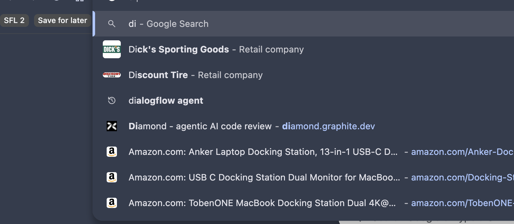

The Discovery page displays servers in a card grid layout:
- **Server Card**: Shows name, description, and key information
- **Category Badge**: Indicates server type (AI, Dev, Data, etc.)
- **Installation Status**: Shows if server is already installed
- **Ratings**: Community ratings and review count

#### Filtering and Search

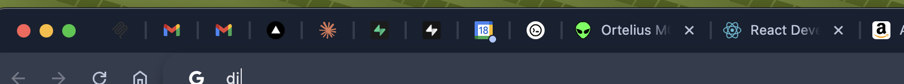

**Search Bar**: Type to search by name, description, or keywords

**Filter Options:**
- **Category**: Filter by server category
- **Source**: Choose between Registry, GitHub, or NPM
- **Installed**: Show only installed or available servers
- **Sort By**: Relevance, popularity, or recent updates

#### Installing Servers

1. **Browse or Search**: Find the server you want to install
2. **Click Server Card**: Opens detailed information modal
3. **Review Details**: Check requirements and configuration options
4. **Click Install**: Begins the installation process
5. **Configure**: Set up required environment variables
6. **Activate**: Enable for your selected AI client

#### Server Details Modal

When you click on a server card, you'll see:
- **Full Description**: Detailed explanation of server capabilities
- **Installation Instructions**: Step-by-step setup guide
- **Configuration Template**: Pre-filled configuration options
- **Dependencies**: Required software or API keys
- **Documentation Link**: Access to full documentation
- **Community Reviews**: User feedback and ratings

### Managing Installed Servers

#### Viewing Installed Servers
- Toggle the "Installed" filter to see only your servers
- Green checkmark indicates successful installation
- Click to view configuration or update

#### Updating Servers
- Update notifications appear on server cards
- Click "Update" to install the latest version
- Review changelog before updating

#### Removing Servers
1. Open the installed server's details
2. Click "Uninstall" button
3. Confirm removal
4. Server configuration is backed up automatically

### Discovery Settings

Access Discovery settings via the gear icon:

**Catalog Source**:
- MCP Registry (recommended)
- GitHub Search
- NPM Registry
- Custom URL

**Auto-Update**:
- Enable automatic server updates
- Set update check frequency
- Configure update notifications

**Cache Settings**:
- Clear discovery cache
- Set cache duration
- Offline mode options

---

## Managing MCP Servers

### Viewing Configured Servers

Once you select a client, you'll see all configured MCP servers in a table format:

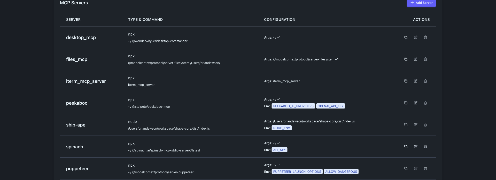

Each server entry shows:
- Server name
- Command type (npx, node, python, etc.)
- Arguments
- Environment variables
- Action buttons (copy, edit, delete)

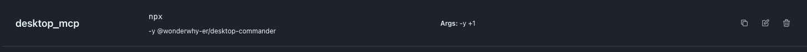

### Adding a New Server

1. Click the **Add Server** button in the top right corner
2. The Add Server modal will appear:

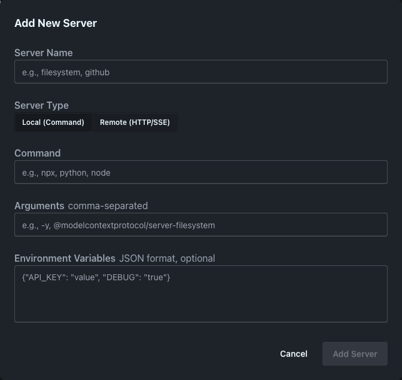

3. Fill in the server details:

#### Server Configuration Fields


- **Server Name**: A descriptive name for your MCP server (e.g., "GitHub MCP Server")
- **Server Type**: Choose between:
  - **Local (Command)**: For locally installed servers
  - **Remote (HTTP/SSE)**: For remote server connections
- **Command**: The command to run (e.g., `npx`, `node`, `python`)
- **Arguments**: Command-line arguments (comma-separated or one per line)

#### Environment Variables

Environment variables are entered in JSON format:

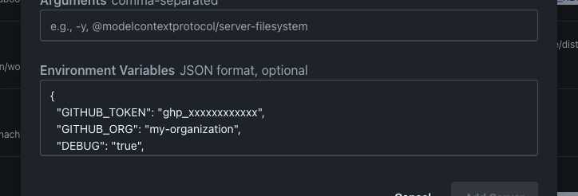

Example format:
```json
{
  "GITHUB_TOKEN": "ghp_xxxxxxxxxxxx",
  "GITHUB_ORG": "my-organization",
  "DEBUG": "true",
  "API_URL": "https://api.github.com"
}
```

4. Click **Add Server** to save your configuration

### Editing Existing Servers

1. Find the server you want to edit in the list
2. Click the **Edit** button (pencil icon) in the Actions column
3. Modify the server configuration in the modal
4. Click **Save** to apply changes

### Deleting Servers

1. Find the server you want to remove
2. Click the **Delete** button (trash icon) in the Actions column
3. Confirm the deletion when prompted

### Copying Server Configuration

Click the **Copy** button to copy the server's JSON configuration to your clipboard. This is useful for:
- Sharing configurations with team members
- Backing up server settings
- Moving configurations between clients

---

## Configuration Scopes

MCP Configuration Manager supports multiple configuration scopes, allowing you to manage settings at different levels:

### User Scope

The default scope for personal configurations:


- Stored in your home directory
- Applies to all your projects
- Location varies by client (e.g., `~/.claude/claude_desktop_config.json`)

### Project Scope

Project-specific configurations that override user settings:

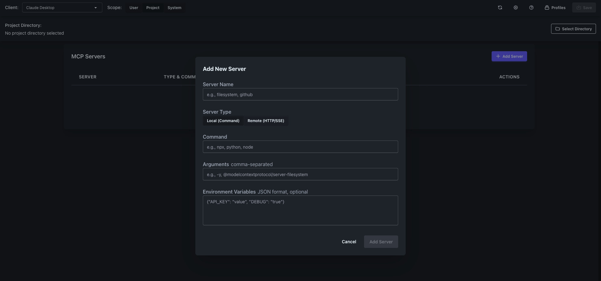

- Stored in project directories
- Takes precedence over user configurations
- Ideal for team-shared settings
- Requires selecting a project directory

### System Scope

System-wide configurations for all users:

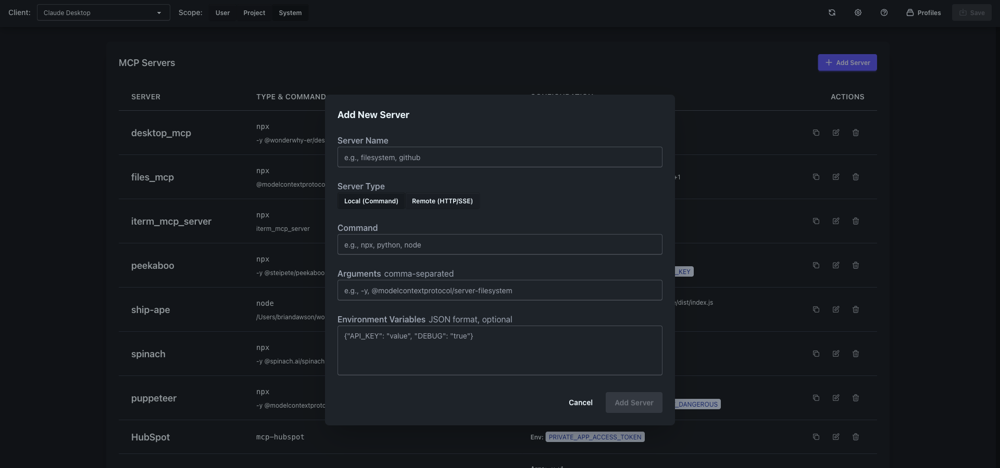

- Stored in system directories
- Requires administrator privileges to modify
- Applies to all users on the machine
- Lowest priority (overridden by user and project scopes)

### Scope Hierarchy

Configuration priority (highest to lowest):
1. **Project** - Most specific, highest priority
2. **User** - Personal settings
3. **System** - Global defaults

### Status Bar

The status bar shows the current configuration file path:

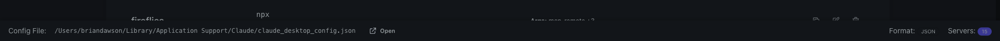

This helps you verify which configuration file you're currently editing.

---

## Settings

Access application settings by clicking the **Settings** button in the top navigation:

### Client Management

Manage detected clients and add custom client configurations:

(Settings screenshots would go here if they were captured)

- View all detected AI clients
- Check installation paths
- Add custom client configurations
- Enable/disable client detection

### General Settings

Configure application preferences:
- **Theme**: Choose between Dark, Light, or System theme
- **Auto-save**: Enable automatic configuration saving
- **Backup**: Set backup preferences
- **Notifications**: Configure notification settings

### Advanced Settings

Developer and power user options:
- **Debug Mode**: Enable detailed logging
- **Config Validation**: Strict or lenient validation rules
- **File Watching**: Auto-reload on external changes
- **Export/Import**: Backup and restore all configurations

---

## Profiles

Profiles allow you to save and switch between different sets of MCP server configurations:

### Creating a Profile

1. Click the **Profiles** button in the navigation bar
2. Select **Create New Profile**
3. Enter a profile name and description
4. Choose which servers to include
5. Save the profile

### Switching Profiles

1. Click the **Profiles** button
2. Select a profile from the list
3. The configuration will switch to the selected profile

### Managing Profiles

- **Export Profile**: Share profiles with team members
- **Import Profile**: Load profiles from files
- **Delete Profile**: Remove unused profiles

---

## Troubleshooting

### Common Issues

#### "Failed to detect clients" Error

If you see this error message, it means the app couldn't find installed AI clients:

1. Ensure your AI clients are properly installed
2. Check that they're in standard installation locations
3. Try adding custom client paths in Settings

#### Configuration Not Saving

1. Check file permissions for the configuration directory
2. Ensure you have write access to the config file
3. Try running the app with administrator privileges for system scope

#### Servers Not Working

1. Verify the command path is correct
2. Check that all required environment variables are set
3. Test the command manually in a terminal
4. Review the server logs in your AI client

### File Locations

#### macOS
- Claude Desktop: `~/Library/Application Support/Claude/claude_desktop_config.json`
- Claude Code: `~/.claude/claude_code_config.json`
- Kiro: `~/.kiro/settings/mcp.json`


---

## Keyboard Shortcuts

| Action | Shortcut |
|--------|----------|
| Save Configuration | `Cmd/Ctrl + S` |
| Add New Server | `Cmd/Ctrl + N` |
| Delete Selected | `Delete` or `Backspace` |
| Open Settings | `Cmd/Ctrl + ,` |
| Switch Client | `Cmd/Ctrl + 1-9` |
| Toggle Scope | `Tab` |
| Search Servers | `Cmd/Ctrl + F` |
| Refresh | `Cmd/Ctrl + R` |
| Quit | `Cmd/Ctrl + Q` |

---

## Best Practices

### Security

1. **Never commit tokens**: Use environment variables for sensitive data
2. **Use project scope**: Keep project-specific servers in project configs
3. **Regular backups**: Export your configurations regularly
4. **Validate servers**: Test servers before saving configurations

### Organization

1. **Naming conventions**: Use descriptive server names
2. **Group related servers**: Use profiles for different workflows
3. **Document configurations**: Add comments in environment variables
4. **Version control**: Track project configurations in git

### Performance

1. **Limit active servers**: Only enable servers you actively use
2. **Optimize environment variables**: Remove unused variables
3. **Regular cleanup**: Remove obsolete server configurations
4. **Monitor resources**: Check server resource usage

---

## Advanced Features

### Bulk Operations

1. Select multiple servers using checkboxes
2. Use bulk actions menu for:
   - Enable/disable multiple servers
   - Export selected servers
   - Delete multiple servers
   - Copy configurations

### Import/Export

#### Exporting Configurations

1. Go to Settings > Advanced
2. Click "Export All Configurations"
3. Choose export format (JSON or YAML)
4. Save to file

#### Importing Configurations

1. Go to Settings > Advanced
2. Click "Import Configurations"
3. Select your configuration file
4. Review and confirm import

### Custom Client Support

Add support for unsupported AI clients:

1. Go to Settings > Client Management
2. Click "Add Custom Client"
3. Configure:
   - Client name
   - Configuration file path
   - File format (JSON, YAML, TOML)
   - Configuration structure

---

## Getting Help

### Resources

- **GitHub Issues**: [Report bugs or request features](https://github.com/thechrisgreen/mcp-config-manager/issues)
- **Documentation**: [Online documentation](https://github.com/thechrisgreen/mcp-config-manager/docs)
- **MCP Specification**: [Model Context Protocol docs](https://modelcontextprotocol.io)

### Contact

- **Email**: support@mcp-manager.com
- **Discord**: Join our community server
- **Twitter**: @MCPManager

---

## Appendix

### Configuration File Format

MCP server configurations follow this structure:

```json
{
  "mcpServers": {
    "server-name": {
      "command": "npx",
      "args": ["@modelcontextprotocol/server-name"],
      "env": {
        "API_KEY": "your-key-here"
      }
    }
  }
}
```

### Supported Command Types

- `npx`: Node Package Execute
- `node`: Node.js scripts
- `python`: Python scripts
- `uvx`: Python UV package executor
- `docker`: Docker containers
- `bash`: Shell scripts
- Custom executables

### Environment Variable Best Practices

1. Use uppercase with underscores: `API_KEY`, `DEBUG_MODE`
2. Namespace your variables: `GITHUB_TOKEN`, `GITHUB_ORG`
3. Document required vs optional variables
4. Never hardcode sensitive values

---

## Keyboard Shortcuts

### Global Shortcuts

| Shortcut | Action | Description |
|----------|--------|-------------|
| **Cmd/Ctrl + S** | Save Configuration | Save current configuration changes |
| **Cmd/Ctrl + Shift + S** | Save All | Save all pending changes across clients |
| **Cmd/Ctrl + R** | Refresh | Reload current configuration |
| **Cmd/Ctrl + F** | Search | Open search in current context |
| **Cmd/Ctrl + ,** | Settings | Open settings panel |
| **Cmd/Ctrl + Q** | Quit | Exit the application |

### Navigation Shortcuts

| Shortcut | Action | Description |
|----------|--------|-------------|
| **Cmd/Ctrl + 1** | Configuration Tab | Switch to Configuration view |
| **Cmd/Ctrl + 2** | Visual Workspace | Switch to Visual Workspace |
| **Cmd/Ctrl + 3** | Discovery | Switch to Discovery page |
| **Cmd/Ctrl + 4** | Profiles | Open Profiles manager |
| **Tab** | Next Field | Navigate to next input field |
| **Shift + Tab** | Previous Field | Navigate to previous field |

### Visual Workspace Shortcuts

| Shortcut | Action | Description |
|----------|--------|-------------|
| **Space** | Pan Mode | Hold to enable canvas panning |
| **Cmd/Ctrl + Plus** | Zoom In | Increase canvas zoom |
| **Cmd/Ctrl + Minus** | Zoom Out | Decrease canvas zoom |
| **Cmd/Ctrl + 0** | Reset Zoom | Reset to default zoom |
| **Delete** | Delete Node | Remove selected server node |
| **Cmd/Ctrl + A** | Select All | Select all nodes on canvas |
| **Escape** | Deselect | Clear current selection |

### Server Management

| Shortcut | Action | Description |
|----------|--------|-------------|
| **Cmd/Ctrl + N** | New Server | Open Add Server dialog |
| **Cmd/Ctrl + D** | Duplicate | Duplicate selected server |
| **Cmd/Ctrl + E** | Edit Server | Edit selected server |
| **Cmd/Ctrl + Delete** | Delete Server | Remove selected server |
| **Space** | Toggle Enable | Enable/disable selected server |

### Discovery Shortcuts

| Shortcut | Action | Description |
|----------|--------|-------------|
| **/** | Quick Search | Focus search bar |
| **Cmd/Ctrl + I** | Install Server | Install selected server |
| **Cmd/Ctrl + U** | Check Updates | Check for server updates |
| **F** | Toggle Filter | Show/hide filter panel |

---

## Features Overview

### Core Capabilities

#### Multi-Client Support
- **Supported Clients**: Claude Desktop, Claude Code, VS Code, Cursor, Kiro, Windsurf, Codex, Gemini Desktop, Gemini CLI
- **Auto-Detection**: Automatically discovers installed AI clients
- **Platform**: macOS only

#### Configuration Management
- **Visual Editing**: Form-based interface prevents JSON syntax errors
- **Validation**: Real-time validation of configurations
- **Backup & Restore**: Automatic backups before changes
- **Import/Export**: Share configurations between systems

#### Advanced Features
- **Visual Workspace**: Interactive canvas for server management
- **Server Discovery**: Marketplace for finding and installing servers
- **Bulk Operations**: Apply changes to multiple servers at once
- **Profiles**: Save and switch between configuration sets
- **Monitoring**: Real-time server status and metrics

### Version History

#### Version 0.1.4 (Current)
- Added Visual Workspace with React Flow canvas
- Introduced Server Discovery marketplace
- Added support for Kiro and Windsurf clients
- Enhanced drag-and-drop functionality
- Improved performance and stability

#### Version 0.1.3
- Added profile management
- Enhanced validation engine
- Improved error handling
- Added bulk operations

#### Version 0.1.2
- Initial public release
- Core configuration management
- Multi-client support
- Basic server management

---

*Last updated: Version 0.1.4*